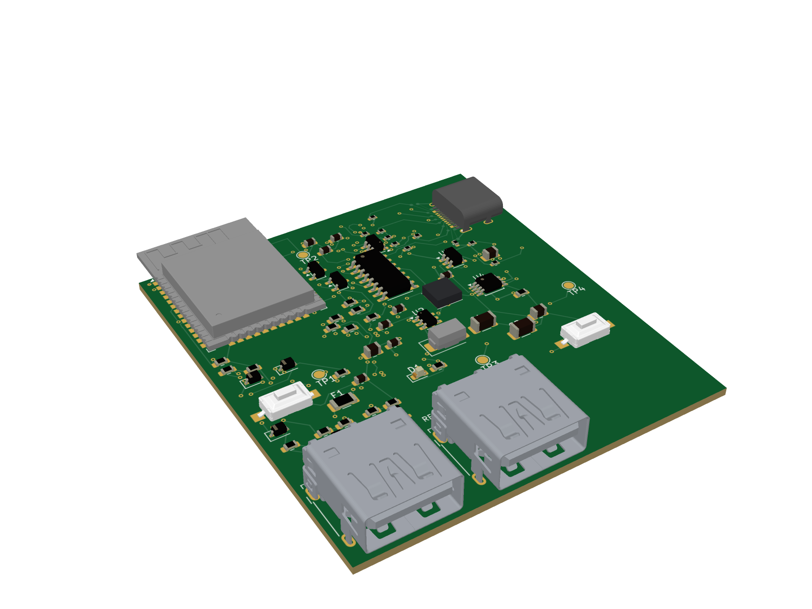

# PlayBridge PS1 Wireless Adapter

PlayBridge is an ESP32-based wireless bridge that receives PC controller state
over Wi-Fi and presents it to an original PlayStation through the native PS1
controller protocol.

## Hardware versions

| Version | Design | Status |
| --- | --- | --- |
| `v1.0.0` | Direct PCB-mounted PS1 pin array | Frozen prototype checkpoint under [`versions/v1-pcb-mounted-pin-array/`](versions/v1-pcb-mounted-pin-array/) |
| `v2.0.0` | Modular donor-plug harness through board-mounted 9-contact connectors | Frozen release candidate under [`versions/v2-donor-plug-modular-adapter/`](versions/v2-donor-plug-modular-adapter/) |
| `v2.1.0` | V2.0 baseline plus status LEDs and UART debug access | Release candidate under [`versions/v2.1-status-leds-uart-debug/`](versions/v2.1-status-leds-uart-debug/) |
| `v2.2` | V2.1 baseline plus a third SNAC-style donor-harness connector (J4) | Active development under [`versions/v2.2-third-snac-connector/`](versions/v2.2-third-snac-connector/) |

Each hardware release is a self-contained FabDesk project under `versions/`.
Open the version directory itself in FabDesk; the repository root is only the
project index plus shared firmware and documentation.

## V2.0.0 status

_Board render created with [PCB Fiddle](https://pcbfiddle.com/)._

- Board: 56.295 × 62.000 mm, four copper layers, 1.20 mm thick.
- J1: 9-contact non-USB connector for a genuine PS1 donor-plug harness.
- J2: mechanically identical reserved connector; every contact is intentionally NC.
- J3: USB-C programming/power receptacle on the right edge, facing outward.
- J1 and J2: lower-edge mating mouths face outward and remain registered to the approved Molex footprints.
- Routing: complete; zero unconnected items.
- DRC: zero errors and zero warnings.
- ERC: zero errors and zero warnings.
- Schematic/PCB parity: zero findings.
- FabDesk release gate: PASS.
- PCBA data: 63 fitted references, 32 grouped BOM lines, and four DNP test pads.
- Controller-port bench firmware passed visible original-PS1 system-menu testing over Wi-Fi: all supported digital buttons worked, quick clicks were reliable, and the final check recorded 17,913 complete polls.

The design release is electrically and mechanically validated. Ordering still
requires a final live JLCPCB stock check and review of the uploaded BOM/CPL
rotation previews; see
[`versions/v2-donor-plug-modular-adapter/ordering/DO-NOT-ORDER.md`](versions/v2-donor-plug-modular-adapter/ordering/DO-NOT-ORDER.md).

## Repository layout

- `versions/v1-pcb-mounted-pin-array/` — complete frozen V1 FabDesk project, fit checks, historical renders, and provisional-contact studies.
- `versions/v2-donor-plug-modular-adapter/` — complete V2.0.0 FabDesk project, manufacturing package, reports, tools, references, and accepted renders.
- `versions/v2.1-status-leds-uart-debug/` — complete V2.1.0 FabDesk project, debug interface, manufacturing package, reports, tools, and accepted renders.
- `versions/v2.2-third-snac-connector/` — active V2.2 FabDesk project for the third SNAC-style connector (J4).
- `firmware/playbridge_wifi_test/` — shared ESP32 Wi-Fi controller firmware and bench instructions.
- `docs/` — shared protocol and modular-interconnect diagrams.

## Opening a hardware project

In FabDesk, select the desired directory under `versions/`, not the repository
root. New hardware work should begin by copying the latest applicable version
to a new version directory so previous releases remain unchanged.

## Important connector warning

J1 and J2 use USB 3 Type-A connector hardware only as inexpensive keyed
9-contact interconnects. They carry native console signals and are **NOT USB**.
Never connect either port to a computer, charger, or ordinary USB peripheral.
