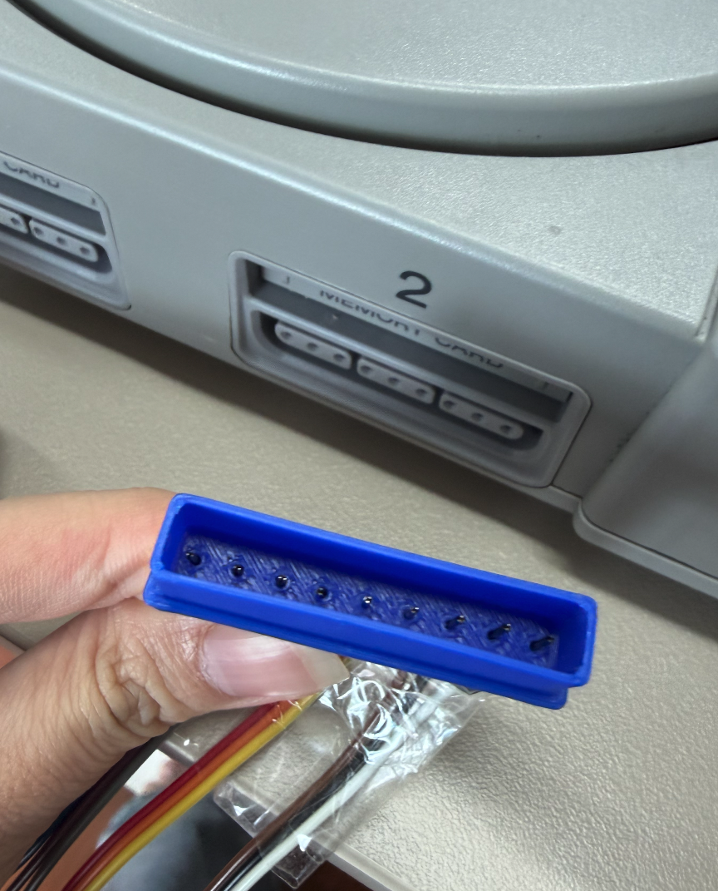
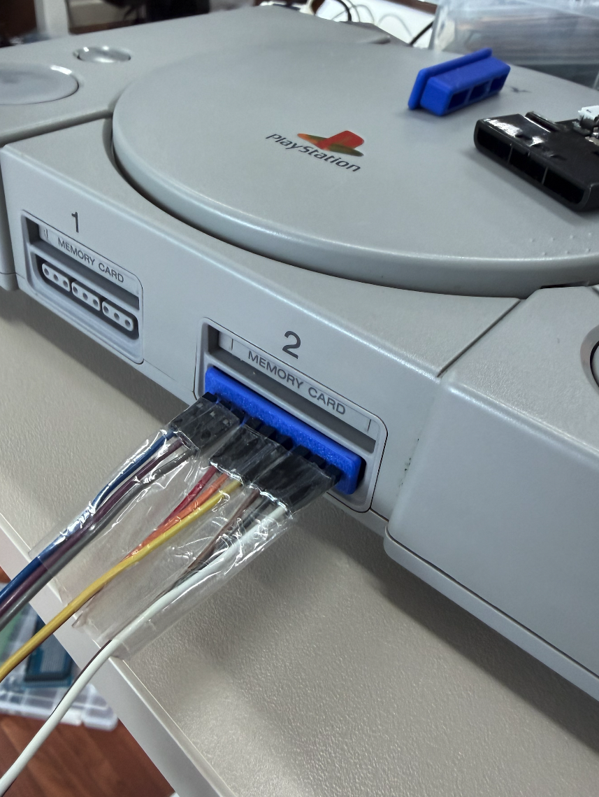
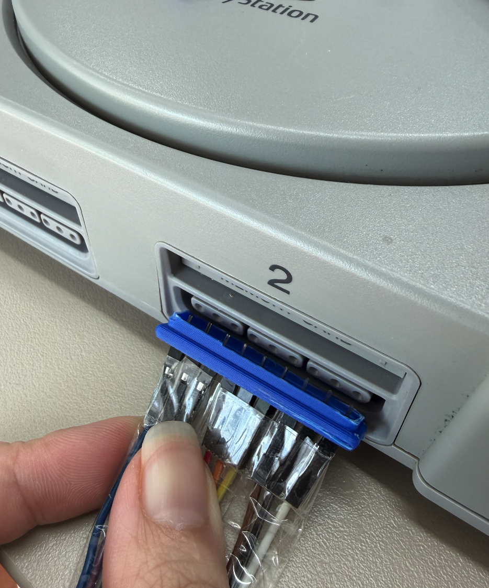

# PS1 direct-plug fit checks

These models are provisional mechanical test fixtures for the PlayBridge
direct-plug connector. They are not final enclosure or manufacturing CAD.

## STL files

- [`playbridge-ps1-fit-check-v4-one-piece.stl`](stl/playbridge-ps1-fit-check-v4-one-piece.stl)
  tests the one-piece printed guide and overall controller-port fit.
- [`9-pin-fitcheck.stl`](stl/9-pin-fitcheck.stl) tests simultaneous insertion
  and alignment of all nine metal contacts. The model measures approximately
  39.4 x 9.8 x 2.5 mm.

Print at 100% scale. Perform initial insertion tests with the console powered
off and do not force the fixture if the contacts do not align freely.

## Physical test photos

### One-piece V4

### Nine-pin insertion coupon

The photos document early fit checks only. Electrical contact reliability,
final tolerances, retention and production pin selection still require
validation.
